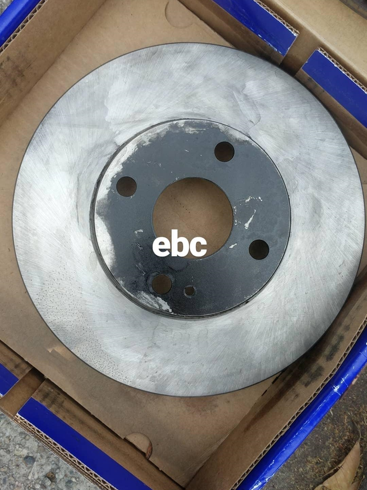
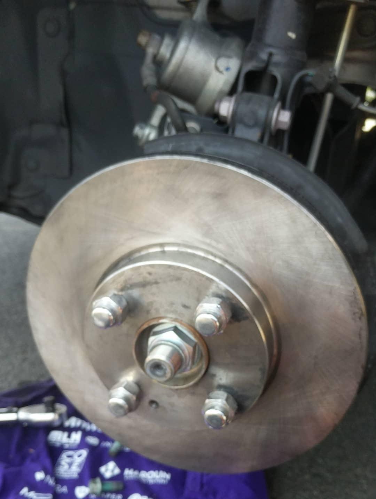
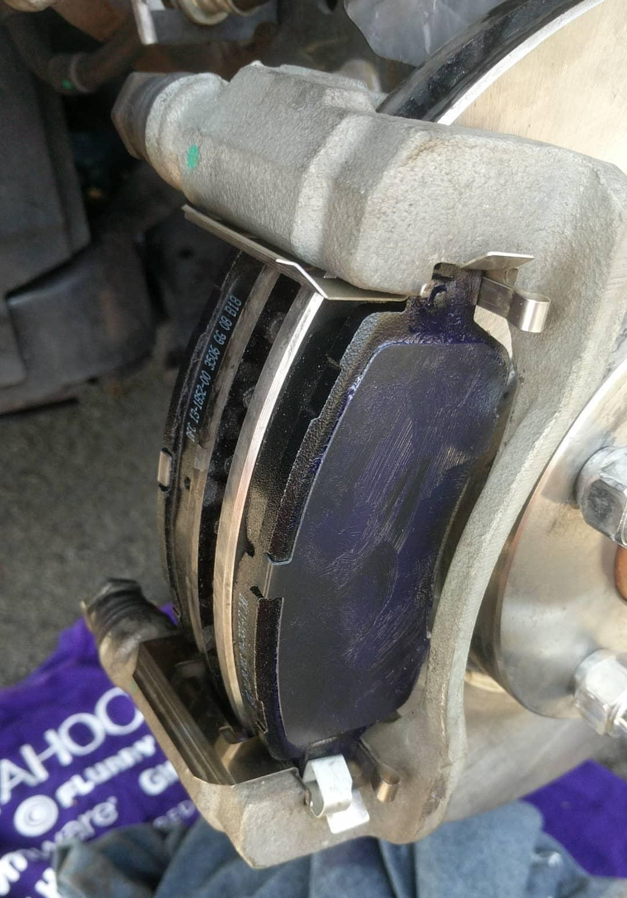

# Scion-iA-EBC-Rotors
Discussion on Scion iA brake rotor replacement.

# Reason for replacement
The reason why I replaced them is due to constant squeak and squealing noise.

Previously, I had my pads replaced with OE from the Toyota dealership (Mazda pads). I had my rotors resurfaced. But the rust came back.

The issue was in cold starts, cold weather, mornings/nights, winter time especially. I suspect it was the pads were scratching on the rusted surface but with heat after usage, the pads would stop scratching the rusted area.

These new rotors don't seem special, so the rust may come back, but I wanted to learn/experience how to replace the rotors myself.

# ChrisFix Youtube
I pretty much followed [ChrisFix's guide](https://youtu.be/lU6OKQxSg8U) on changing the brake rotors. I used brake lubricant instead of anti-seize. It seemed hard to find in stores in-person.

# Parts
The rotors I used was by [EBC](https://www.carid.com/2016-scion-ia-brakes/ebc-rk-series-replacement-brake-rotors-769390562.html).
They seems fairly standard in quality compared to the OE type.
The black coating is just the oil protection the manufacturer uses to protect the rotors. After cleaning it with brake cleaner, its all comes off entirely.
I would suggest trying out StopTech if you want drilled/slotted rotors.

The ceramic brake pads I used was by [PBR](http://a.co/abNQCPs). Again, seems the same size and quality compared to Mazda.

I used Loctite red threadlocker.
Standard brake cleaner and lubricant from Autozone.

# Before you begin
The only thing I would suggest in advance of doing this job yourself is to remember to have a hammer (preferably rubber) to remove the old rotors.
Make sure to place the brake caliper safely without putting tension in the brake line. Some people use a bucket or tie some rope to let it hang. I, conveniently, let it rest behind the coilover.

# Images
</img>
</img>
</img>
